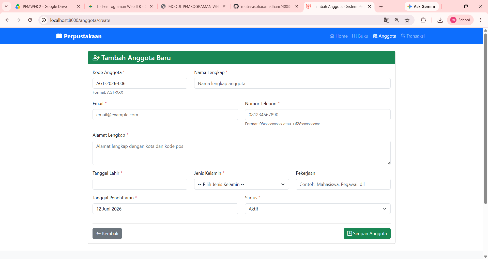
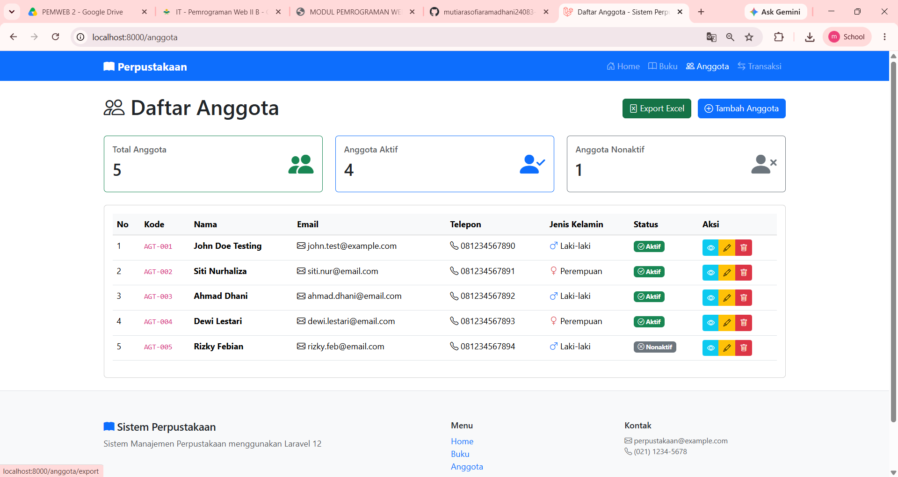
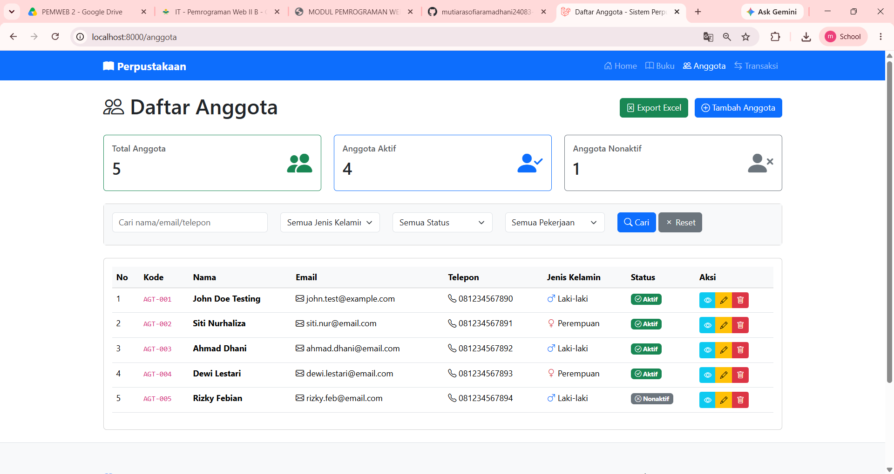

## TUGAS PERTEMUAN 13
Nama : Mutiara Sofia Ramadhani 

NIM  : 60324083

Kelas : Pemrogramman Web 2 - B

### 1. Tugas 1: Auto-Generate Kode Anggota
Kode anggota otomatis terisi dan bersifat *readonly* agar tidak bisa diubah secara manual.
 

### 2. Tugas 2: Export Data ke Excel
Tombol export pada halaman indeks anggota yang akan menghasilkan *file* spreadsheet.
 

📁 **Hasil Export Excel:** [Download / Lihat File Excel](screenshot/excel13.xlsx)

### 3. Tugas 3: Advanced Search & Filter
Kotak pencarian dan filter kompleks yang berfungsi dengan baik.
