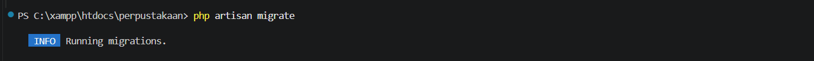
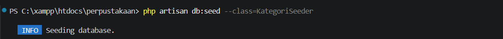
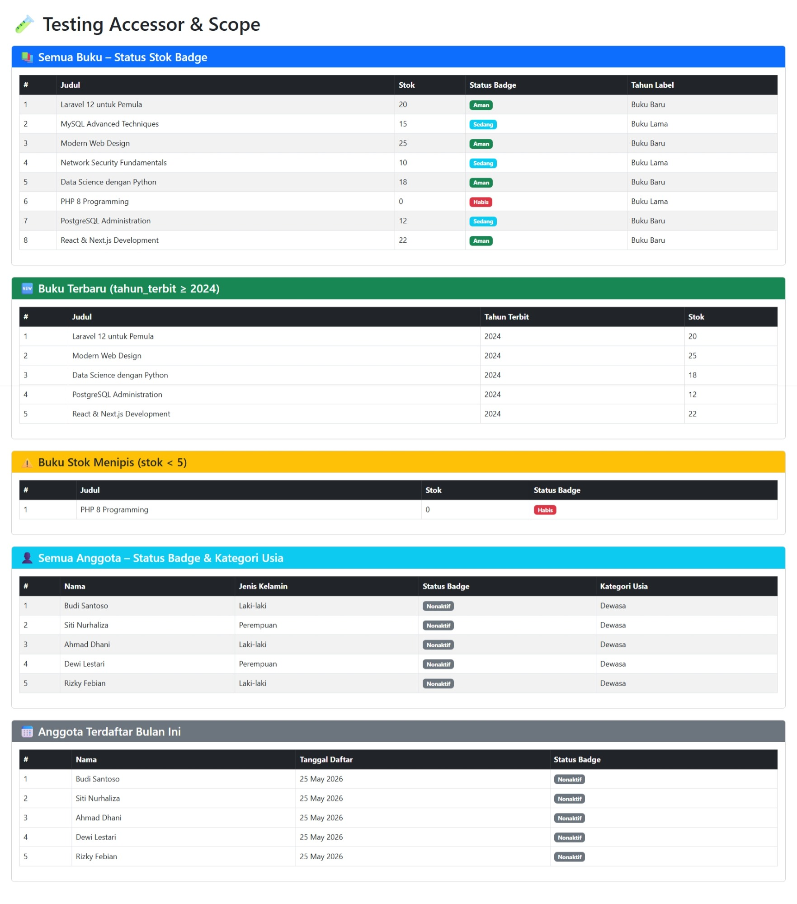

## PERTEMUAN 10
Nama : Mutiara Sofia Ramadhani 

NIM  : 60324083

Kelas : Pemrogramman Web 2 - B
## Tugas 1: Migration Tabel Kategori

**1. Hasil Eksekusi Migration**

**2. Hasil Eksekusi Seeder**

---

## Tugas 2: Model Accessor & Scope

**1. Hasil Testing Accessor & Scope di Browser**
